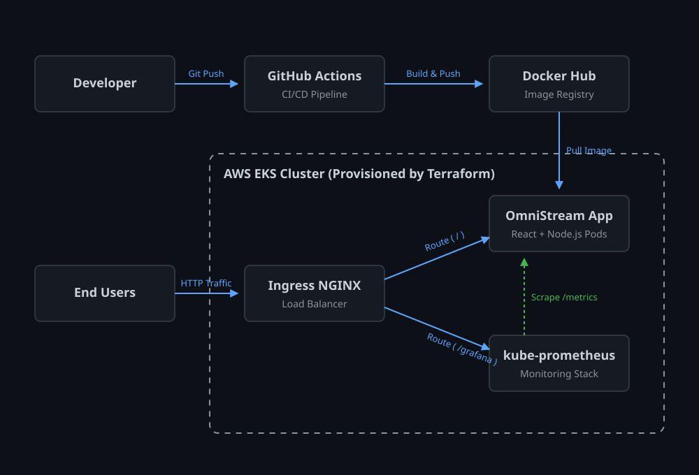

# OmniStream

[View Demo Video](https://drive.google.com/file/d/1s7NaZDYYzLVXpFAdhtdBvqhW1FJJkjEZ/view?usp=sharing)

## About the Project
OmniStream is a robust, full-stack web application designed to operate on a highly available Kubernetes cluster. It leverages modern web technologies paired with infrastructure-as-code to provide a scalable, monitoring-ready ecosystem. The project emphasizes automation, integrating continuous integration pipelines with automated cloud provisioning to ensure reliable deployments and real-time observability under heavy traffic loads.

## Features
- **Modern Frontend**: React-based dashboard built with Vite, Tailwind CSS, and Recharts for dynamic data visualization.
- **Type-Safe Backend**: Node.js and Express API utilizing an in-memory datastore for rapid resilience, fully typed from end-to-end using TRPC.
- **Infrastructure as Code**: Automated AWS Elastic Kubernetes Service (EKS) cluster provisioning using Terraform.
- **Container Orchestration**: Deployed securely on Kubernetes with Ingress NGINX handling reliable traffic routing and load balancing.
- **Observability Stack**: Integrated Prometheus and Grafana stack configured via Helm to scrape and visualize live application metrics.
- **CI/CD Automation**: GitHub Actions pipeline for automated Docker image building and registry publishing directly to Docker Hub.

## Architecture


## Bugs and Errors Faced
During the development and deployment of OmniStream, several complex infrastructure, capacity, and scaling issues were encountered and resolved. A comprehensive log of these challenges and their precise solutions can be found in the attached documentation:

[View the Bugs and Errors Log](errorfix.md)

## How to Clone and Use

### Prerequisites
- Docker
- AWS CLI configured with appropriate credentials
- Terraform CLI
- kubectl and Helm

### Installation Steps

1. **Clone the repository:**
   ```bash
   git clone https://github.com/Goutham-K-278/OmniStream.git
   cd OmniStream
   ```

2. **Provision the Infrastructure:**
   Navigate to the terraform directory and apply the configuration to spin up the EKS cluster.
   ```bash
   cd terraform
   terraform init
   terraform apply
   ```

3. **Configure Kubernetes Access:**
   Link your local machine to the newly created EKS cluster.
   ```bash
   aws eks update-kubeconfig --region us-east-1 --name omnistream-cluster
   ```

4. **Deploy the Ingress Controller:**
   Install the NGINX Ingress controller to handle incoming traffic.
   ```bash
   kubectl apply -f https://raw.githubusercontent.com/kubernetes/ingress-nginx/controller-v1.10.1/deploy/static/provider/aws/deploy.yaml
   ```

5. **Deploy the Monitoring Stack:**
   Use Helm to install Prometheus and Grafana for live metrics tracking.
   ```bash
   helm install monitoring prometheus-community/kube-prometheus-stack -f kubernetes/prometheus-values.yaml
   ```

6. **Deploy the Application:**
   Apply the Kubernetes deployment, service, and ingress routing rules.
   ```bash
   cd ..
   kubectl apply -f kubernetes/deployment.yaml
   kubectl apply -f kubernetes/ingress.yaml
   ```

7. **Access the Application:**
   Retrieve the external address of the Load Balancer and navigate to it in your web browser.
   ```bash
   kubectl get ingress
   ```
